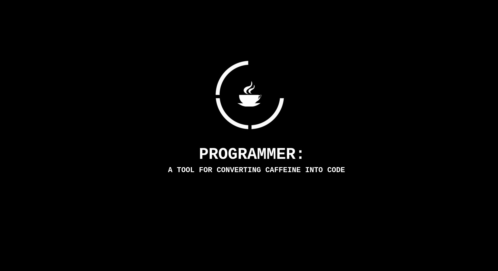

<!--
<h1 align="center">Hi 👋, I'm Abdullah</h1>
<h3 align="center">A passionate software developer from Yemen</h3>


<p align="left">  </p>


<p align="left"> <a href="https://twitter.com/geekydart" target="blank"></a> </p>

- 🔭 I’m currently working on [Html, CSS & JS](https://github.com/GeekyHacks/personal-Portfolio.git)

- 🌱 I’m currently learning **Html, CSS & JS**

- 👯 I’m looking to collaborate on [web development](https://github.com/GeekyHacks/Web-Dev-For-Beginners.git)

- 👨‍💻 All of my projects are available at [github.com/GeekyHacks](github.com/GeekyHacks)

- 📝 I regularly write articles on [twitter.com/GeekyDart](twitter.com/GeekyDart)

- 💬 Ask me about **Html, CSS & JS**

<h3 align="left">Connect with me:</h3>
<p align="left">
<a href="https://codepen.io/geekyhacks" target="blank"></a>
<a href="https://twitter.com/geekydart" target="blank"></a>
<a href="https://linkedin.com/in/abdullah-nasser-711625268" target="blank"></a>
<a href="https://stackoverflow.com/users/21147339" target="blank"></a>
<a href="https://instagram.com/geekyhacks" target="blank"></a>
<a href="https://www.youtube.com/c/www.youtube.com/@geekyhacks4045" target="blank"></a>
<a href="https://www.hackerrank.com/geekyhacks22" target="blank"></a>
<a href="https://auth.geeksforgeeks.org/user/user_geekyhacks22" target="blank"></a>
</p>

<h3 align="left">Languages and Tools:</h3>
<p align="left"> <a href="https://www.w3schools.com/css/" target="_blank" rel="noreferrer">  </a> <a href="https://dart.dev" target="_blank" rel="noreferrer">  </a> <a href="https://flutter.dev" target="_blank" rel="noreferrer">  </a> <a href="https://git-scm.com/" target="_blank" rel="noreferrer">  </a> <a href="https://www.w3.org/html/" target="_blank" rel="noreferrer">  </a> <a href="https://www.adobe.com/in/products/illustrator.html" target="_blank" rel="noreferrer">  </a> <a href="https://developer.mozilla.org/en-US/docs/Web/JavaScript" target="_blank" rel="noreferrer">  </a> <a href="https://kotlinlang.org" target="_blank" rel="noreferrer">  </a> <a href="https://www.linux.org/" target="_blank" rel="noreferrer">  </a> <a href="https://www.mysql.com/" target="_blank" rel="noreferrer">  </a> <a href="https://www.photoshop.com/en" target="_blank" rel="noreferrer">  </a> <a href="https://www.php.net" target="_blank" rel="noreferrer">  </a> </p>

<p></p>

<p>&nbsp;</p>

<p></p>
-->

<!--new profile styling-->
<h1 align="left"> 
    
</h1>
<p align="center"> </p> 

- 🔭 I am a Full Stack Developer student with a love for JavaScript, & Dart. I play strategy games and read philosophical books in my spare time. Open to new opportunities.s
- 📫 How to reach me:
- <a href="https://codepen.io/geekyhacks" target="blank"></a>
<a href="https://twitter.com/geekydart" target="blank"></a>
<a href="https://linkedin.com/in/abdullah-nasser-711625268" target="blank"></a>
<a href="https://stackoverflow.com/users/21147339" target="blank"></a>
<a href="https://instagram.com/geekyhacks" target="blank"></a>
<a href="https://www.youtube.com/c/www.youtube.com/@geekyhacks4045" target="blank"></a>
<a href="https://www.hackerrank.com/geekyhacks22" target="blank"></a>
<a href="https://auth.geeksforgeeks.org/user/user_geekyhacks22" target="blank"></a>
</p>

### Skills

- <p align="left"> <a href="https://www.w3schools.com/css/" target="_blank" rel="noreferrer">  </a> <a href="https://dart.dev" target="_blank" rel="noreferrer">  </a> <a href="https://flutter.dev" target="_blank" rel="noreferrer">  </a> <a href="https://git-scm.com/" target="_blank" rel="noreferrer">  </a> <a href="https://www.w3.org/html/" target="_blank" rel="noreferrer">  </a> <a href="https://www.adobe.com/in/products/illustrator.html" target="_blank" rel="noreferrer">  </a> <a href="https://developer.mozilla.org/en-US/docs/Web/JavaScript" target="_blank" rel="noreferrer">  </a> <a href="https://kotlinlang.org" target="_blank" rel="noreferrer">  </a> <a href="https://www.linux.org/" target="_blank" rel="noreferrer">  </a> <a href="https://www.mysql.com/" target="_blank" rel="noreferrer">  </a> <a href="https://www.photoshop.com/en" target="_blank" rel="noreferrer">  </a> <a href="https://www.php.net" target="_blank" rel="noreferrer">  </a> </p>

### 🚀 A little more about me...

```javascript
const Abdullah = {
  lookingFor: [Front_end_developer, Web_developer, Software_developer],
  code: [JavaScript, Dart, Kotlin, Html, Css],
  askMeAbout: [Javascript, Dart],
  hobbies: [Strategy_Games, Chess],
};
```

<div align='left'>

<p>&nbsp;</p>

<p></p>

<p color="black" ></p>

<p align="center"  >  </p>

</div>


---  

